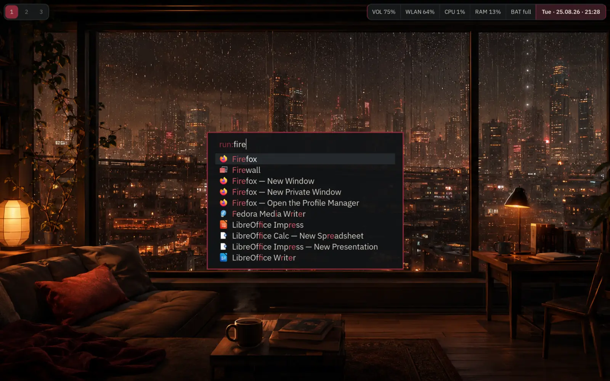

# Sway Noir

Sway Noir is a standalone Sway profile with a warm charcoal theme, muted
burgundy accents and Vim-style navigation. It installs below
`~/.config/sway-noir` without replacing an existing Sway configuration.



## Features

- Matching Waybar, Fuzzel, Mako, swaylock and wallpaper theme
- Automatic output detection without a fixed layout or workspace assignments
- Vim-style focus, movement and resize bindings
- Touchpad tapping and three- or four-finger workspace gestures
- Flat pointer profile for mice and touchpads
- Automatic night color through Gammastep
- Manual locking without automatic lock or suspend
- Update-safe overrides in `sway/config.d/99-local.conf`

The profile is developed and tested on Fedora 44 with Sway 1.11. Other
distributions may work but are not tested.

## Install

Install the required Fedora packages:

```bash
sudo dnf install sway swaybg swaylock waybar fuzzel mako foot gammastep \
    ibm-plex-sans-fonts wireplumber playerctl brightnessctl grim \
    pulseaudio-utils
```

On other distributions, install the equivalent packages. Debian names Mako
`mako-notifier` and provides `fonts-ibm-plex` through `contrib`; Arch provides
the font as `ttf-ibm-plex`.

Clone and install the profile:

```bash
git clone https://github.com/mi-uh/sway-noir.git
cd sway-noir
./install.sh
```

Start it from a TTY with `~/.config/sway-noir/start-sway-noir`. For an optional
GDM entry, install the system wrapper and session file once:

```bash
sudo install -Dm755 session/start-sway-noir /usr/local/bin/start-sway-noir
sudo install -Dm644 session/sway-noir.desktop \
    /usr/share/wayland-sessions/sway-noir.desktop
```

Then select **Sway Noir** when logging in.

## Configure and update

The installer creates `~/.config/sway-noir/sway/config.d/99-local.conf` once
and never overwrites it. Use it for terminal, keyboard, input, monitor and
workspace overrides. Examples are included.

Gammastep starts automatically. To disable it for future sessions, add this to
`99-local.conf`, then log out and back in:

```sway
set $gammastep_command true
```

Update from the cloned repository:

```bash
git pull
./install.sh
```

## Keys

- `Super+h/j/k/l`: focus
- `Super+Shift+h/j/k/l`: move windows
- `Super+r`, then `h/j/k/l`: resize mode
- `Super+1..0`: switch workspace
- `Super+Shift+1..0`: move window to workspace
- `Super+p/n`: cycle workspaces on the focused output
- `Super+d`: Fuzzel
- `Super+Enter`: terminal
- `Super+Shift+x`: lock
- `Super+Shift+q/e`: close window / exit Sway

## Backup and removal

Before replacing files, the installer stores a timestamped backup below
`${XDG_CONFIG_HOME:-$HOME/.config}/sway-setup-backups`. Copy the selected
backup's `sway-noir` contents back into the profile directory to restore it.

```bash
config_root="${XDG_CONFIG_HOME:-$HOME/.config}"
cp -a "$config_root/sway-setup-backups/YYYYMMDD-HHMMSS/sway-noir/." \
    "$config_root/sway-noir/"
```

Remove Sway Noir while keeping its backups:

```bash
rm -r "${XDG_CONFIG_HOME:-$HOME/.config}/sway-noir"
sudo rm -f /usr/local/bin/start-sway-noir \
    /usr/share/wayland-sessions/sway-noir.desktop
```

## License

Sway Noir is released under the MIT License. The wallpaper and lock-screen
artwork were generated with ChatGPT.
